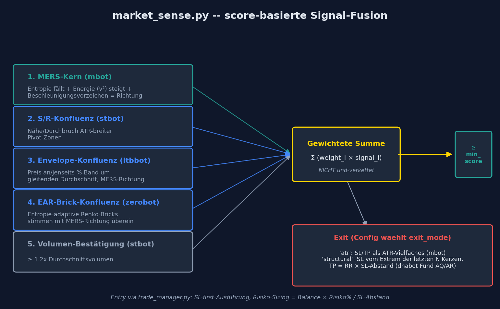
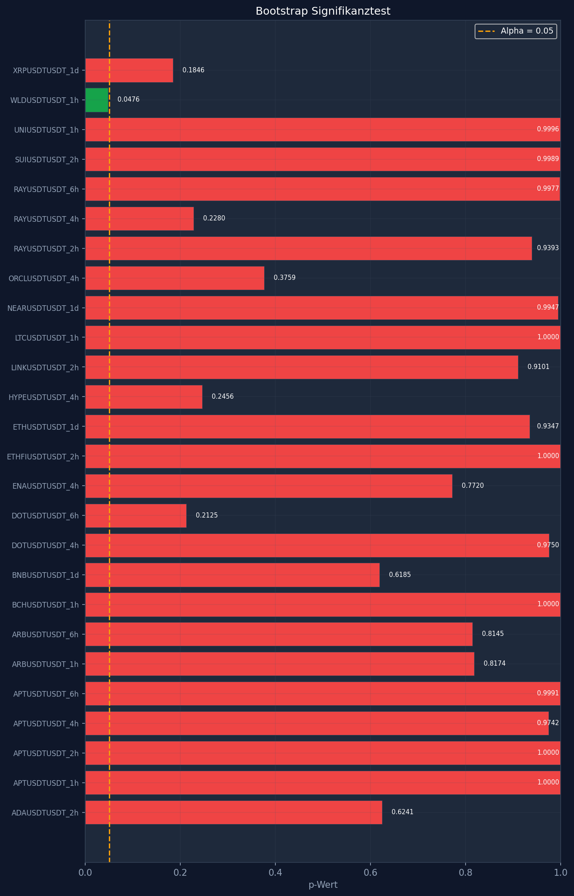
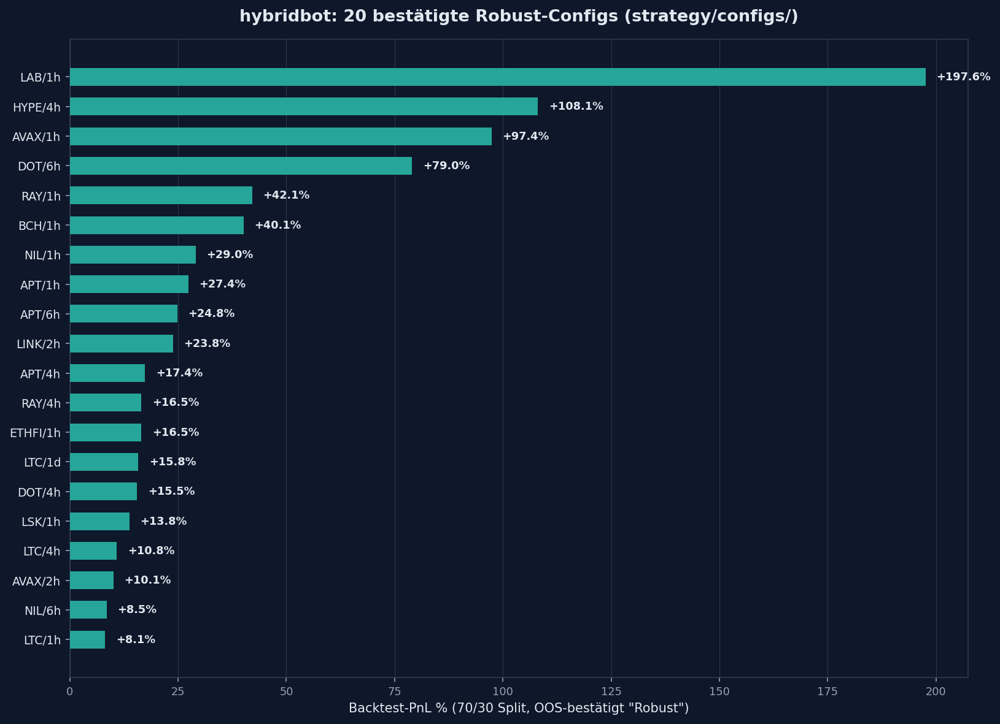

# hybridbot


Kombiniert die validierten Kernideen aus **fünf eigenen Bots** (mbot, stbot,
ltbbot, zerobot, dnabot) zu **einem** score-basierten Markt-Sensing-Signal,
statt sie als fünf Einzelbots parallel zu pflegen. Entstanden am 2026-09-10,
nachdem der SMC/Fibonacci-basierte Vorgänger `superbot` trotz Regime-Gate-Fix
und Multi-Symbol-Training overfitted blieb — hybridbot baut stattdessen
ausschließlich auf Bausteinen mit echtem oder zumindest fair validiertem
Track Record.

**Aktueller Status: Forward-Dry-Run.** `live_trading` steht per Default auf
`false` — der Bot loggt echte, unverbrauchte Signale, platziert aber noch
keine Orders. Details siehe [⚠️ Wichtige Hinweise](#️-wichtige-hinweise).

## 📚 Inhaltsverzeichnis

- [Übersicht](#-übersicht)
- [Warum diese fünf Bots](#-warum-diese-fünf-bots-und-nicht-fibotoraclebot)
- [Signal-Architektur im Detail](#-signal-architektur-im-detail)
- [Features](#-features)
- [Systemanforderungen](#-systemanforderungen)
- [Installation](#-installation)
- [🔴 Live Trading](#-live-trading)
- [📊 Interaktives Pipeline-Script](#-interaktives-pipeline-script)
- [Analyse-Script](#-analyse-script-run_analysissh)
- [Coin-Screening & Massen-Suche](#-coin-screening--massen-suche)
- [Auto-Optimizer Verwaltung](#-auto-optimizer-verwaltung)
- [Monitoring & Ergebnisse](#-monitoring--ergebnisse)
- [Wartung & Pflege](#️-wartung--pflege)
- [Tests](#-tests)
- [Projekt-Struktur](#-projekt-struktur)
- [⚠️ Wichtige Hinweise](#️-wichtige-hinweise)
- [Coin & Timeframe Empfehlungen](#-coin--timeframe-empfehlungen)
- [Lizenz](#-lizenz)

## 📊 Übersicht

- **Ein** Signal-Modul (`market_sense.py`) statt fünf getrennter Bot-Codebasen
- Score-Fusion aus 5 unabhängigen Konfluenz-Quellen, gewichtete Summe statt
  starrer UND-Verkettung
- Zwei wählbare Exit-Modi pro Config: `atr` (mbot, live-proven) oder
  `structural` (dnabot Fund AQ/AR, mehrfach unabhängig reproduziert)
- Portfolio-Optimizer (Greedy-Selektion, Calmar-Objective) statt manueller
  Coin-Auswahl
- **20 bestätigte "Robust"-Configs** (70/30-Split, Out-of-Sample bestätigt)
  bereits in `strategy/configs/`, siehe [Coin & Timeframe Empfehlungen](#-coin--timeframe-empfehlungen)

## 🧭 Warum diese fünf Bots (und nicht fibot/oraclebot)

Vor der Übernahme wurde jeder Kandidat gegen den echten Track Record
geprüft, nicht gegen Backtest-Versprechen:

| Bot | Beitrag | Grund |
|---|---|---|
| **mbot** | Entry-Trigger (MERS) + Risiko-Sizing | Einziger Bot mit verifiziertem echtem Live-Track-Record (+200% seit Mai) |
| **stbot** | S/R-Konfluenz + Volumen-Filter | `energy_zscore`/`avalanche_percentile`-Muster fair validiert gegen 172 echte Live-Trades |
| **ltbbot** | Envelope-Band-Konfluenz | Eigenständige Wedge/Channel-Logik, unabhängig von stbots Pivot-Zonen |
| **zerobot** | EAR-Brick-Konfluenz | Live seit Juni, EAR-Renko-Kernlogik nach gefixtem Live/Backtest-Divergenz-Bug bestätigt |
| **dnabot** | Structural-Exit (Fund AQ/AR) | Nur der neue Gene-Exit-Ansatz übernommen — der alte Richtungs-Vorhersage-Ansatz ist widerlegt (-99% Walk-Forward) |

Zwei geprüfte Kandidaten wurden **bewusst ausgeschlossen**:

- **fibot**: echter Live-Track-Record 10% Winrate / -10,64 USDT über 100
  Trades (Bitget-API, read-only verifiziert)
- **oraclebot**: Backtest behauptete 73-80% Winrate, real waren es
  42,1% → 28,6% → 16,7% in aufeinanderfolgenden Perioden, plus ein
  strukturelles 30-50%-Max-Drawdown-Profil

## 🔍 Signal-Architektur im Detail



```
Kerze
  │
  ▼
strategy/signals/market_sense.py — EIN score-basiertes Signal
  │
  ├─ 1. MERS-Kern (mbot)        Entropie fällt + Energie(v²) steigt +
  │                              Beschleunigungsvorzeichen = Richtung
  ├─ 2. S/R-Konfluenz (stbot)   Nähe/Durchbruch ATR-breiter Pivot-Zonen
  ├─ 3. Envelope-Konfluenz      Preis an/jenseits %-Band um gleitenden
  │     (ltbbot)                 Durchschnitt, in MERS-Richtung
  ├─ 4. EAR-Brick-Konfluenz     Entropie-adaptive Renko-Bricks stimmen
  │     (zerobot)                 mit MERS-Richtung überein
  └─ 5. Volumen-Bestätigung     ≥ 1.2x Durchschnittsvolumen
        (stbot-Muster)
  │
  Gewichtete Summe gegen min_score (NICHT UND-verkettet — 5-fach-AND-
  Konfluenz führte in einem Vorgänger-Bot zu 0 gültigen Optimizer-Trials)
  │
  ▼
Exit (exit_mode-Config, Optimizer wählt):
  'atr'        SL/TP als ATR-Vielfaches (mbot, live-proven)
  'structural' SL vom Extrem der letzten N Kerzen, TP = RR × SL-Abstand
               (dnabot Fund AQ/AR, mehrfach backtest-reproduziert)
  │
  ▼
utils/trade_manager.py — SL-first-Ausführung, Risiko-Sizing =
Balance × Risiko% / SL-Abstand, Housekeeper für verwaiste Positionen,
Portfolio-Risk-Gate + Circuit Breaker
```

**Performance-Hinweis:** Der erste Entwurf nutzte `pandas.rolling().apply()`
mit Python-Callbacks für rollierende Entropie und einen `.iloc`-Python-Loop
für die S/R-Pivot-Suche — ~68 Kerzen/Sek. Auf reine numpy-Arrays +
vektorisierte rollierende Entropie umgestellt: **~635 Kerzen/Sek.**, über 9x
schneller.

## 🚀 Features

**Trading:**
- [x] Score-basierte Multi-Signal-Fusion (5 Quellen, gewichtete Summe)
- [x] Zwei Exit-Modi pro Symbol/Timeframe wählbar (`atr` / `structural`)
- [x] Portfolio-Optimizer mit Calmar-Objective (Greedy-Selektion, max. Positionen konfigurierbar)
- [x] Risikobasiertes Positions-Sizing (Risiko% je Trade statt fixer Notional)
- [x] Portfolio-Risk-Gate (max. gleichzeitiges Gesamtrisiko, Tagesverlust-Bremse, Verlustserien-Stop)
- [x] Auto-Optimizer-Scheduler (wöchentliche Re-Optimierung, optional)

**Technisch:**
- [x] Verwaiste-Positionen-Housekeeping (`master_runner.py`, überwacht Positionen auch nach Config-Rotation weiter)
- [x] Vektorisierte Backtester-Engine (numpy statt Pandas-Rolling-Callbacks)
- [x] 19 statistische Analyse-Module (Walk-Forward, Bootstrap, Monte Carlo, Kelly, Korrelation, Regime …)
- [x] Coin-Screening vor der teuren vollen Optimizer-Pipeline (`screen_candidates.py`)
- [x] Telegram-Benachrichtigungen (Entry/Exit, Optimizer-Ergebnisse)

## 📋 Systemanforderungen

- Python 3.10+
- Bitget-Account mit API-Keys (Futures/Swap-Handel aktiviert)
- Telegram-Bot-Token (optional, für Benachrichtigungen)

## 💻 Installation

```bash
git clone https://github.com/Youra82/hybridbot.git
cd hybridbot

chmod +x install.sh
./install.sh
```

`install.sh` installiert die System-Abhängigkeiten (Python 3.12, git, curl,
jq), legt `.venv` an, installiert `requirements.txt` und setzt
Ausführungsrechte für alle `.sh`-Skripte. Danach:

```bash
cp secret.json.example secret.json
# secret.json mit echten Bitget-Keys ("hybridbot") + Telegram-Daten befüllen
```

Alternativ manuell (z. B. unter Windows, wo `install.sh` nicht läuft):

```bash
python -m venv .venv
source .venv/bin/activate        # Windows: .venv\Scripts\activate
pip install -r requirements.txt
```

`secret.json.example`:
```json
{
  "telegram": {
    "bot_token": "DEIN_TELEGRAM_BOT_TOKEN",
    "chat_id":   "DEINE_CHAT_ID"
  },
  "hybridbot": {
    "api_key":    "DEIN_BITGET_API_KEY",
    "api_secret": "DEIN_BITGET_API_SECRET",
    "passphrase": "DEIN_BITGET_PASSPHRASE"
  }
}
```

`secret.json` steht in `.gitignore` — niemals committen.

## 🔴 Live Trading

```bash
python -m hybridbot.strategy.run --symbol "BTC/USDT:USDT" --timeframe "1d" --mode signal
```

Für den Dauerbetrieb übernimmt `master_runner.py` die komplette aktive
Watchlist (aus `settings.json::live_trading_settings.active_strategies` oder,
bei `use_auto_optimizer_results: true`, aus dem letzten Portfolio-Optimizer-
Lauf) und startet pro Symbol/Timeframe einen eigenen `run.py`-Prozess. Dabei
werden zusätzlich **verwaiste offene Positionen** erkannt (Tracker zeigt
`status: open`, aber Symbol/Timeframe ist nicht mehr in der aktiven Liste) und
trotzdem weiter überwacht, statt unbeaufsichtigt zu bleiben.

```bash
# Master Runner starten
cd ~/hybridbot && .venv/bin/python3 master_runner.py
```

Per Crontab (Beispiel: alle 15 Minuten, mit `flock` gegen Überlappung):

```cron
*/15 * * * * /usr/bin/flock -n ~/hybridbot/hybridbot.lock /bin/sh -c "cd ~/hybridbot && .venv/bin/python3 master_runner.py >> ~/hybridbot/logs/cron.log 2>&1"
```

`live_trading` ist per Default **`false`** — kein Live-Go, bevor
Walk-Forward auf dem Hold-out-Test mindestens STABIL liefert (siehe
[⚠️ Wichtige Hinweise](#️-wichtige-hinweise)).

## 📊 Interaktives Pipeline-Script

Einzelner Backtest (ohne Optimierung):

```bash
python -m hybridbot.analysis.backtester --symbol "BTC/USDT:USDT" --timeframe "1h" \
    --start_date "2023-01-01" --end_date "2025-01-01"
```

Das eigentliche **`run_pipeline.sh`** automatisiert die komplette
`market_sense`-Parameter-Optimierung (Optuna, 70/30-Split) für beliebig
viele Symbol/Timeframe-Kombinationen.

### Features des Pipeline-Scripts

✅ **Interaktive Eingabe** — geführte Menü-Navigation, jeder Schritt hat
einen sinnvollen Default
✅ **Optionaler Walk-Forward-OOS-Test** — Optimizer trainiert nur vor einem
gewählten Stichtag, Backtester prüft danach auf nie gesehenen Daten (ASCII-
Zeitleiste zeigt Trainings-/Testperiode vor dem Start)
✅ **Automatische Lookback-Empfehlung** je Timeframe (15m/30m: 180 Tage …
1d: 1825 Tage)
✅ **Zwei Optimierungs-Modi**: `strict` (profitabel + Mindest-Winrate +
MaxDD-Limit) oder `best_profit` (nur MaxDD-Limit, maximiert PnL)
✅ **Optionale Fixierung** der MERS-Kern-Parameter (`min_entropy_drop`,
`min_energy_rise`, `exit_mode`) statt sie von Optuna mitoptimieren zu lassen
✅ **Batch-fähig** — mehrere Coins/Timeframes in einem Lauf, jede Kombination
läuft nacheinander automatisch durch

### Verwendung

```bash
chmod +x run_pipeline.sh
./run_pipeline.sh
```

Ablauf der Eingabeaufforderungen (alle mit Default bei Enter):

1. **Alte Configs löschen?** (j/n, Standard n) — kompletter Neustart der
   Optimierung. Es gibt **keinen separaten `cleanup`-Befehl** — das ist
   diese erste interaktive Ja/Nein-Frage selbst.
2. Handelspaar(e) + Zeitfenster (leer = automatisch aus `settings.json`)
3. Optionales OOS-Startdatum für den Walk-Forward-Test (leer = Standard-Modus
   ohne OOS-Split)
4. Startdatum oder `a` für automatische Lookback-Berechnung
5. Startkapital, CPU-Kerne, Anzahl Trials
6. Optimierungs-Modus (`strict`/`best_profit`), Max Drawdown %, Min. Win-Rate %
7. Optional: MERS-Kern-Parameter fixieren (Zahl eingeben) oder frei lassen
   (Enter → Optuna optimiert)

Am Ende jedes Laufs: `./show_results.sh` zur Kontrolle, `settings.json`
aktivieren, dann `master_runner.py` starten.

Ergebnis-Configs landen in `src/hybridbot/strategy/configs/`:

```
src/hybridbot/strategy/configs/
├── config_LABUSDTUSDT_1h.json
└── ...
```

Optimizer (nicht-interaktiv, direkt per CLI):

```bash
python -m hybridbot.analysis.optimizer \
    --symbols "BTC/USDT:USDT,ETH/USDT:USDT,SOL/USDT:USDT,XRP/USDT:USDT" \
    --timeframe "1d" --start_date "2020-01-01" --end_date "2026-09-10" --trials 60
```

## 📊 Analyse-Script (`run_analysis.sh`)

Interaktives Menü mit 19 statistischen Analyse-Modulen. Jedes Modul schreibt
sein Ergebnis-Chart zusätzlich nach `docs/*_latest.png`:

```bash
chmod +x run_analysis.sh
./run_analysis.sh
./run_analysis.sh --no-telegram    # kein Telegram, nur lokale Ausgabe
```

| # | Analyse | Zweck |
|---|---|---|
| 1 | Walk-Forward Lookback-Analyse | Optimaler `backtest_lookback_weeks` für den Auto-Optimizer |
| 2 | Slippage & Fee Impact | Echte Kosten (Taker-Fee + Slippage) gegen Brutto-PnL |
| 3 | Monte Carlo Simulation | Trade-Reihenfolge resampeln, Drawdown-Verteilung |
| 4 | Bootstrap Signifikanztest | PnL gegen Zufall (Sign-Flip-Resampling) |
| 5 | RR-Ratio Walk-Forward | Effektives TP/SL-Verhältnis über die Zeit |
| 6 | ATR-SL-Multiplier Walk-Forward | Stabilität des SL-Parameters |
| 8 | Parameter Sensitivity | Tornado-Diagramm, welche Config-Parameter am meisten Einfluss haben |
| 9 | Multi-Timeframe Confirmation | Signal-Übereinstimmung über mehrere Timeframes |
| 10 | Parameter-Stabilitäts-Analyse | Wie stark schwanken optimale Parameter zwischen Fenstern |
| 11 | Anti-Korrelations-Portfolio | Korrelationsmatrix zwischen Configs (Portfolio-Diversifikation) |
| 12 | Kelly Position Sizing | Kelly-Kriterium gegen aktuelles `risk_per_trade_pct` |
| 13 | Regime Performance Analysis | PnL nach Markt-Regime aufgeschlüsselt |
| 15 | Confluence Score | Welche der 5 Score-Quellen tragen am meisten zum Ergebnis bei |
| 16 | Volumen-Score-Gewicht Optimierung | Gewichtung statt starrem EIN/AUS-Filter |
| 17 | Tageszeit-Analyse | PnL nach Handelsstunde/Wochentag |
| 18 | Regime-adaptive Parameter | Parameter je Markt-Regime statt global fix |
| 19 | Drawdown Duration Analysis | Wie lange dauern Drawdown-Phasen bis zur Erholung |
| 24 | Timeframe-Vergleich | Dasselbe Symbol über mehrere Timeframes |
| 25 | Reoptimierungs-Snapshot-Glättung | Geglättete vs. Stichtags-Reoptimierung im Vergleich |
| 0 | Alle 1-19 nacheinander | Kompletter Analyse-Durchlauf |

Beispiel-Ergebnis (Bootstrap-Signifikanztest, `docs/bootstrap_latest.png`):



## 🔎 Coin-Screening & Massen-Suche

Vor der teuren vollen Optimizer-Pipeline steht ein schnelles Screening
(wenige Trials, 70/30-Split, Checkpoint-CSV):

```bash
python screen_candidates.py                       # Top 25 Symbole, 20 Trials
python screen_candidates.py --top-n 40 --trials 15
python screen_candidates.py --resume               # bereits gescreente Kombis überspringen
```

Darauf aufbauend gibt es zwei nicht-interaktive Massen-Versionen der echten
Pipeline (`optimizer.py`), die so lange laufen, bis genug Configs bestätigt
sind:

```bash
python batch_pipeline.py --target 20 --trials 80        # erst strict, bei Fehlschlag best_profit
python hunt_robust.py --target-new 9 --trials 80         # zählt nur echte OOS-"Robust"-Verdicts
```

## 🔄 Auto-Optimizer Verwaltung

`auto_optimizer_scheduler.py` prüft Fälligkeit (Zeitplan aus
`settings.json::optimization_settings.schedule`), sperrt gegen parallele
Läufe und ruft bei Fälligkeit `run_portfolio_optimizer.py` auf, das per
Greedy-Selektion (Calmar-Objective) das beste Portfolio aus allen
Einzel-Configs zusammenstellt — begrenzt auf `max_open_positions` aus
`settings.json`.

```bash
cd ~/hybridbot && .venv/bin/python3 auto_optimizer_scheduler.py            # normale Prüfung
cd ~/hybridbot && .venv/bin/python3 auto_optimizer_scheduler.py --force    # sofort erzwingen
cd ~/hybridbot && .venv/bin/python3 run_portfolio_optimizer.py             # manueller Einzellauf
```

Mit `live_trading_settings.use_auto_optimizer_results: true` übernimmt
`master_runner.py` automatisch das jeweils letzte Optimizer-Ergebnis statt
der manuell in `settings.json` gepflegten `active_strategies`-Liste.

## 📊 Monitoring & Ergebnisse

```bash
./show_results.sh
```

Fragt zuerst den Modus ab (1-4, Standard 1):

| Modus | Name | Ablauf |
|---|---|---|
| 1 | Einzel-Backtest | Fragt Start-/Enddatum (Default: letztes OOS-Startdatum aus `artifacts/results/last_oos_run.json`) und Startkapital ab, simuliert **jede** Config in `strategy/configs/` einzeln nacheinander |
| 2 | Manuelle Portfolio-Simulation | Wie Modus 1, aber du wählst interaktiv aus, welche Configs gemeinsam ein Portfolio bilden sollen |
| 3 | Automatische Portfolio-Opt. | Fragt nur Startkapital + Max Drawdown % (kein Datum nötig — OOS-Start wird automatisch erkannt), lässt den Greedy-Optimizer das beste Portfolio zusammenstellen |
| 4 | Interaktive Charts | Ruft `interactive_chart.py` auf, fragt Datum/Kapital direkt selbst ab, zeigt Candlestick-Charts mit Entry/Exit-Markern |

### Log-Files

```bash
tail -f logs/cron.log
```

## 🛠️ Wartung & Pflege

```bash
chmod +x update.sh
bash ./update.sh
```

Sichert `secret.json` und `settings.json`, holt den neuesten Stand via
`git reset --hard origin/main`, stellt beide Dateien danach wieder her und
aktualisiert die Pakete — lokale Live-Konfiguration geht dabei nicht
verloren.

```bash
chmod +x push_configs.sh
./push_configs.sh
```

Listet alle Configs in `strategy/configs/` mit Symbol, Timeframe, Hebel und
OOS-PnL, committet und pusht sie (z. B. nach einem Optimizer-Lauf auf dem
Server). Bei Merge-Konflikten in Config-Dateien: lokale Version behalten,
sofern sie neuer optimiert wurde.

## ✅ Tests

```bash
chmod +x run_tests.sh
./run_tests.sh
```

Aktiviert `.venv` und führt `pytest tests/` aus. **Stand jetzt enthält
`tests/` nur `__init__.py`, noch keine echten Testfälle** — der Lauf meldet
entsprechend "Keine Tests gefunden" (Exit-Code 0, kein Fehler). Sobald
Testdateien für `market_sense.py`/`trade_manager.py` existieren, greift
dasselbe Script ohne Änderung.

## 📂 Projekt-Struktur

```
hybridbot/
├── src/hybridbot/
│   ├── strategy/
│   │   ├── run.py                  # Live-Einstiegspunkt (--mode signal)
│   │   ├── signals/market_sense.py # Das Kern-Signal (5-Quellen-Fusion)
│   │   └── configs/                # config_<SYMBOL><TF>.json, Optimizer-Output
│   ├── analysis/
│   │   ├── backtester.py           # Vektorisierte Backtest-Engine
│   │   ├── optimizer.py            # Optuna, 70/30-Split, OOS-Bestätigung
│   │   ├── oos_tester.py           # Einzel-Config OOS-Robustheitscheck
│   │   ├── portfolio_optimizer.py  # Greedy-Portfolio-Selektion, Calmar-Objective
│   │   └── walk_forward.py, bootstrap_test.py, monte_carlo.py, kelly_sizing.py, …
│   └── utils/
│       ├── exchange.py             # ccxt-Wrapper, OHLCV-Fetch + Cache
│       └── trade_manager.py        # SL-first-Ausführung, Risiko-Sizing
├── master_runner.py                # Autopilot-Dispatch + Orphan-Recovery
├── auto_optimizer_scheduler.py     # Wöchentlicher Re-Optimierungs-Scheduler
├── run_portfolio_optimizer.py      # Manueller Portfolio-Optimizer-Lauf
├── run_pipeline.sh                 # Interaktive Optimizer-Pipeline
├── run_analysis.sh                 # 19-Modul-Analyse-Menü
├── screen_candidates.py            # Schnelles Vor-Screening
├── batch_pipeline.py / hunt_robust.py / reoptimize_calmar.py  # Massen-Suche
├── show_results.sh                 # Backtest/Portfolio/Chart-Anzeige (4 Modi)
├── update.sh / push_configs.sh     # Wartung
├── run_tests.sh                    # pytest-Wrapper
├── install.sh                      # Erstinstallation (.venv, requirements, chmod)
├── settings.json                   # Watchlist, Risk-Manager, market_sense-Fallback
├── secret.json.example             # Vorlage (echte secret.json niemals committen)
└── docs/                           # README-Illustrationen + *_latest.png-Ergebnisse
```

## ⚠️ Wichtige Hinweise

**Risiko-Disclaimer:** Kryptowährungs-Handel mit Hebel ist hochriskant.
hybridbot befindet sich im **Forward-Dry-Run** (Stand 2026-09-24) — es
existiert noch **kein echter Live-Track-Record**, nur:

1. Ein Optimizer-Hold-out-Test (+13,43R, 65 Trades, Bootstrap p=16,7% —
   nicht signifikant für sich genommen)
2. Ein unabhängiger Generalisierungstest auf 8 neuen Symbolen ohne
   Retuning (+36,50R, 166 Trades, p=4,46% — konventionell signifikant)
3. 20 einzeln OOS-bestätigte "Robust"-Configs (70/30-Split je Symbol/Timeframe)

`live_trading` bleibt bewusst auf `false`, bis der laufende Forward-Dry-Run
(`master_runner.py` loggt Signale, ohne Orders zu platzieren) eigene,
noch unverbrauchte Daten liefert.

**Security:** `secret.json` niemals committen (`.gitignore` deckt das ab,
aber vor jedem `git add` trotzdem prüfen). API-Keys nur mit den minimal
nötigen Berechtigungen anlegen (kein Withdraw-Recht).

**Performance-Tipps:**
- `data/cache/` beschleunigt wiederholte Backtests auf demselben
  Symbol/Timeframe erheblich — wird nicht committet (`.gitignore`)
- Bei eigenen Änderungen an `market_sense.py`: `run_tests.sh` vor jedem
  Push ausführen

## 📈 Coin & Timeframe Empfehlungen

20 Configs haben den 70/30-Split-Optimizer **und** den anschließenden
Out-of-Sample-Robustheitscheck (`oos_tester.py`) bestanden. Werte direkt aus
`strategy/configs/config_*.json::_meta.pnl_pct` (Backtest-PnL, kein
fiktiver Wert):



| Symbol | Timeframe | Hebel | Risiko/Trade | Backtest-PnL |
|---|---|---|---|---|
| LAB/USDT | 1h | 6x | 1,69% | +197,6% |
| HYPE/USDT | 4h | 18x | 2,52% | +108,1% |
| AVAX/USDT | 1h | 15x | 1,99% | +97,4% |
| DOT/USDT | 6h | 9x | 0,88% | +79,0% |
| RAY/USDT | 1h | 19x | 2,32% | +42,1% |
| BCH/USDT | 1h | 14x | 2,45% | +40,1% |
| NIL/USDT | 1h | 14x | 1,36% | +29,0% |
| APT/USDT | 1h | 12x | 2,96% | +27,4% |
| APT/USDT | 6h | 9x | 0,52% | +24,8% |
| LINK/USDT | 2h | 11x | 1,92% | +23,8% |
| APT/USDT | 4h | 7x | 2,09% | +17,4% |
| RAY/USDT | 4h | 5x | 1,44% | +16,5% |
| ETHFI/USDT | 1h | 18x | 1,49% | +16,5% |
| LTC/USDT | 1d | 6x | 0,67% | +15,8% |
| DOT/USDT | 4h | 15x | 0,67% | +15,5% |
| LSK/USDT | 1h | 5x | 1,20% | +13,8% |
| LTC/USDT | 4h | 14x | 2,40% | +10,9% |
| AVAX/USDT | 2h | 18x | 1,88% | +10,1% |
| NIL/USDT | 6h | 5x | 1,71% | +8,5% |
| LTC/USDT | 1h | 18x | 1,68% | +8,1% |

Hebel und Risiko% wurden je Config vom Optimizer bestimmt (Calmar-Objective,
`max_drawdown_pct: 30` als harte Nebenbedingung) — **nicht** manuell
nachträglich verändert oder gedeckelt, auch wenn einzelne Werte (z. B. 19x
Hebel bei RAY/1h) auf den ersten Blick hoch wirken.

## 🙏 Credits

hybridbot ist eine Synthese aus fünf eigenständigen Bot-Projekten — mbot
(Entry + Sizing), stbot (S/R + Volumen), ltbbot (Envelope), zerobot
(EAR-Bricks) und dnabot (Structural-Exit, Fund AQ/AR). Jeder Baustein wurde
vor der Übernahme einzeln gegen echten Track Record oder fair validierte
Backtest-Ergebnisse geprüft.

## 📜 Lizenz

MIT License — siehe [LICENSE](LICENSE)-Datei.

---

<p align="center">Made with 📊 and echten Backtests, keinen Versprechen.</p>
